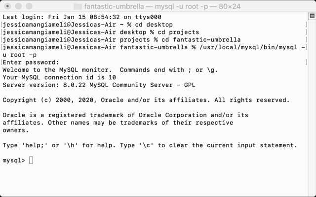

## E-commerce Back End Project

# Description

For this project, a backend to an E- commerce site was created using MySql and Sequelize.

# Installation

* Clone this repository to your computer

* Run the following commands in your terminal:

- npm install mysql2

- npm install sequelize

- npm install dotenv

* You will also need to create a .env file in the root of the project folder and add the following:

DB_NAME='ecommerce_db'

DB_USER='root'

DB_PW='xxx'

* Open MySql shell and run the following:

- source db/schema.sql

* Then quit the MySql shell and run the following on the command line:

- npm run seed

- npm run start

# Application Demo

create schema, seed database and start server

full video: https://drive.google.com/file/d/1AAX_8DKKZIf9Hn8XuPO5nnI8POzeSglH/view

GET routes to return all categories, all products and all tags

full video: https://drive.google.com/file/d/1Ijk0hGP74UKzH4yxjjc-MDgiqz3XamSw/view

GET routes to create a single category, single product and single tag

full video: https://drive.google.com/file/d/1SKr8tYKaBY8cRj0WS_R2gVtDJoZOPO4o/view

POST, PUT and DELETE routes for categories

full video: https://drive.google.com/file/d/14Djv0Wrt-451t8YFkui8yiTGXpF0rxjD/view
